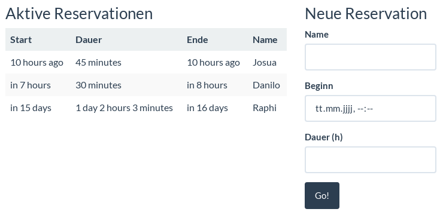

# Ultimaker Reservation Tool

The web interface for the [Reservation API](https://github.com/coredump-ch/reservation-api),
written using [Svelte](https://svelte.dev/).

## Screenshot

## Dev server

    npm run dev
